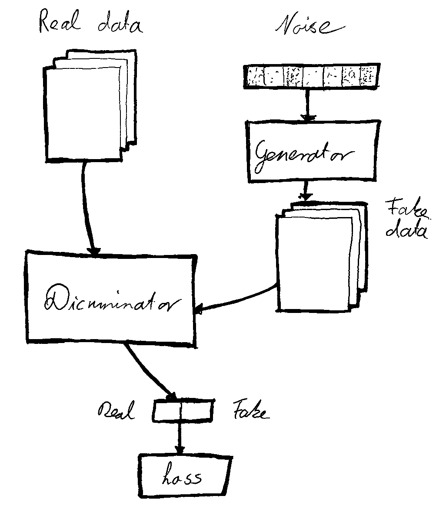

NGDLM - Next Generation Deep Learning Models
===============================

[Dr. Tristan Behrens](http://ai-guru.de)

Overview
--------

Next Generation Deep Learning Models (NGDLM) for Keras is here!

We live in such great times. It is marvellous! You see, basically everyone can do Deep Learning today. This was impossible about a decade ago. Thanks to so many people and institutions so many people have a blast training and deploying Deep Neural Networks.

NGDLM is all about Deep Neural Networks that are beyond simple Feed-Forward Networks. Ever heard about Autoencoders, Generative Adversarial Nets, and Triplet Loss? Implementing those could easily end up in building pyramids. I know what I am talking about.

NGDLM is a toolkit that helps you to easily create and train Deep Neural Networks of the next generation. This includes:

* Autoencoders (AEs)
* Contractive Autoencoders (CAEs)
* Time-Distributed LSTM Autoencoders (TDLSTMAEs)
* Variational Autoencoders (VAEs)
* Triplet-Loss-Trained Nets (TLs)
* Generative Adversarial Nets (GANs)


Installation / Usage
--------------------

To install use pip:

    $ pip install git+https://github.com/ai-guru/ngdlm.git


Or clone the repo:

    $ git clone https://github.com/ai-guru/ngdlm.git
    $ python setup.py install

I guess now you want to see demos? There you go! Note, that there are more examples in the repo.


Demo - Variational Autoencoders
------------

Variational Autoencoders are great! They facilitate unsupervised learning with any data. What do they do? They let you embed any data into latent space. And they let you generate data from that latent space. Both directions! And this works without labels. Do you know another good thing? VAEs latent space is interpolateable. This means that similar samples end up close to each other in latent space.

This is how a VAE architecture looks like:


The trouble with VAEs is their construction. You see, you have to create an encoder and a decoder. That is easy. After that you have to glue them together. While making sure that the encoder predicts Gaussian distributions. And finally you have to add the VAE-loss. Sounds complicated? Yes, it is. But with NGDLM those efforts are reduced to a minimum. See for yourself, how you can train a VAE with NGDLM:

```python
# Import NGDLM models.
from ngdlm import models as ngdlmodels

# Train- and validation-data.
x_input_train = ...
x_input_validate = ...

# Create the encoder.
encoder = ...

# Create the decoder.
decoder = ...

# Create the variational autoencoder.
vae = ngdlmodels.VAE(encoder, decoder, latent_dim=2)
vae.compile(optimizer='adadelta', reconstruction_loss="binary_crossentropy")

# Train.
print("Train...")
history = vae.fit(
        x_input_train, x_input_train,
        epochs=100,
        batch_size=32,
        shuffle=True,
        validation_data=(x_input_validate, x_input_validate)
    )

# Evaluate.
print("Evaluate...")
loss = vae.evaluate(x_input_test, x_input_test)
print("Loss:", loss)
```

So you just create the encoder and the decoder. NGDLM then turns both into a VAE and makes sure that it trains perfectly using the VAE-loss!

Demo - Visualizing Variational Autoencoders
------------

Deep Learning is always about good visuals. How else would you know how good your training is? What is the progress of your model? What is going on? NGDLM provides means for vizializing many aspects of Deep Learning. Most of them are tailored for the Deep Learning models we support.

Just import the `utils` module and you are fine:

```Python
# Import NGDLM utils.
from ngdlm import utils as ngdlutils
```

The most important thing is to render training progress. You can render the history of training like this:

```Python
# Visualizing variational autoencoder.
print("Rendering history...")
ngdlutils.render_history(history)
```


If you want to know how good your VAE is on reconstructing images, you can do this:

```Python
print("Rendering reconstructions...")
ngdlutils.render_image_reconstructions(vae, x_input_train[0:10])
```


Of course, inspecting the latent space of a VAE is something very, very nice. This helps you getting an idea how the latent space is structured:

```Python
print("Rendering latent-space...")
ngdlutils.render_image_latent_space(vae.decoder, 10)
```


And finally, you can also plot how your data is arranged in latent space, assuming that you have their labels:

```Python
print("Rendering encodings...")
ngdlutils.render_encodings(vae.encoder, x_input_test, y_output_test)
```


Nice, isn't it?

Demo - Triplet-Loss Training
------------

Let me provide another example... Remember [FaceNet](https://arxiv.org/abs/1503.03832)? Right, Google's Neural Net that takes photos of faces and embeds them into a vector. Yes, like word-embeddings. What they did is something huge. They trained with Triplet-Loss. You create a neural network that maps faces to embeddings. You then use three copies of that network and combine them into one huge Neural Net. And on top of that you than add the Triplet-Loss, which minimizes the distance between samples of the same class and maximizes the distance between samples of different classes. Sounds like a huge effort implementing it? True!


And constructing the net is just the beginning. For Triplet-Loss training you need a sampling strategy. Usually during training you select for each sample a minibatch for positives and one for negatives. You then use the current model in order to find the positive that is farthest away and the negative that is closest to the current sample. This is a complicated algorithm. Which is implemented in NGDLM.

Let me show you how Triplet-Loss training looks like with NGDLM:

```python
# Import NGDLM models.
from ngdlm import models as ngdlmodels

# Train- and test-data.
x_input_train, y_output_train = ...
x_input_test, y_output_test = ...

# Triplet loss.
latent_dim = 8

# Create the base-model.
base = ...

# Create the triplet loss model.
tl = ngdlmodels.TL(base)
tl.compile(optimizer="rmsprop", triplet_loss="euclidean")

# Train.
print("Train...")
history = tl.fit(
        x_input_train, y_output_train,
        epochs=1000,
        batch_size=128,
        steps_per_epoch=1000,
        minibatch_size=10,
        shuffle=True,
        validation_data=(x_input_validate, y_output_validate),
        validation_steps=500
    )
```

Demo - Visualizing Triplet-Loss
------------

Again, visualizing works like a charm with NGDLM. Here is the history:

```python
print("Rendering history...")
ngdlutils.render_history(history)
```


And here is how to render the encodings both for training and validation:

```python
print("Rendering encodings...")
ngdlutils.render_encodings(tl.base, x_input_train, y_output_train)
ngdlutils.render_encodings(tl.base, x_input_validate, y_output_validate)
```


Demo - Generative Adversarial Nets
-------------------------------------

GANs are yet another story. They are a mix of Deep Learning and Game Theory. Here you introduce a Generator (G) that generates samples for latent space. And you introduce a Discriminator (D) that predicts whether an image is fake or not. You train them at the same time. It is a competition. In the end you will have a generator that creates very convincing samples.

This is how such an architecture looks like:



The GAN architecture looks a little complicated. It is. Also the training is complex. Well, you train two nets that are opponents at the same time. With NGDLM it is rather easy to create and train GANs. Have a look:

```Python
# Import NGDLM models.
from ngdlm import models as ngdlmodels

# Some parameters.
latent_dim = 100
input_shape = (28, 28, 1)

# Generator.
generator = ...

# Discriminator.
discriminator = ...

# Load and transform the dataset.
x_input_train = ...

# Create the net and train.
gan = ngdlmodels.GAN(generator=generator, discriminator=discriminator)
gan.compile(
    optimizer=optimizers.Adam(0.0002, 0.5),
    loss="binary_crossentropy",
    metrics=['accuracy'])
gan.summary()
history = gan.fit(x_input_train, epochs=30000, batch_size=32, sample_interval=200)
```


Get in touch
------------

Feel free to contact me anytime! You can reach me via the resources below.
If you would like to create a bug-report or a feature-request do not hesitate to do so [here](https://github.com/AI-Guru/ngdlm/issues).

- [Official AI-Guru Homepage](https://ai-guru.de/)
- [AI-Guru Slack](https://join.slack.com/t/ai-guru/shared_invite/enQtNDEzNjUwMTIwODM0LTdlOWQ1ZTUyZmQ5YTczOTUxYzk2YWI4ZmE0NTdmZGQxMmUxYmUwYmRhMDg1ZDU0NTUxMDI2OWVkOGFjYTViOGQ)
- [AI Guru Facebookpge](https://www.facebook.com/AIGuruTristanBehrens)
- [Tristan Behrens on LinkedIn](https://www.linkedin.com/in/tristan-behrens-734967a2/)

You can add me on the social platforms anytime! Namaste!
